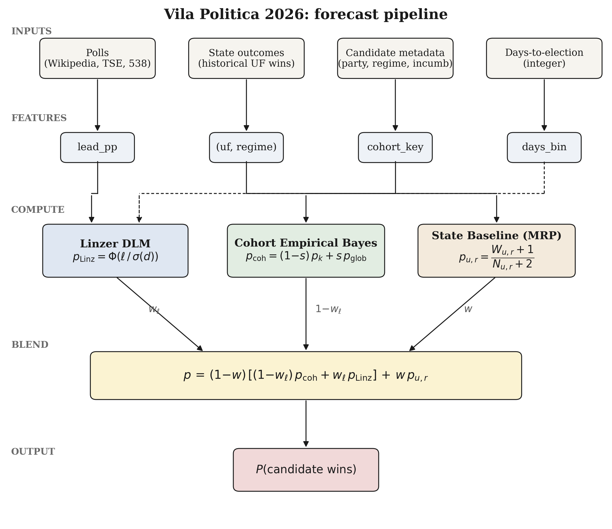
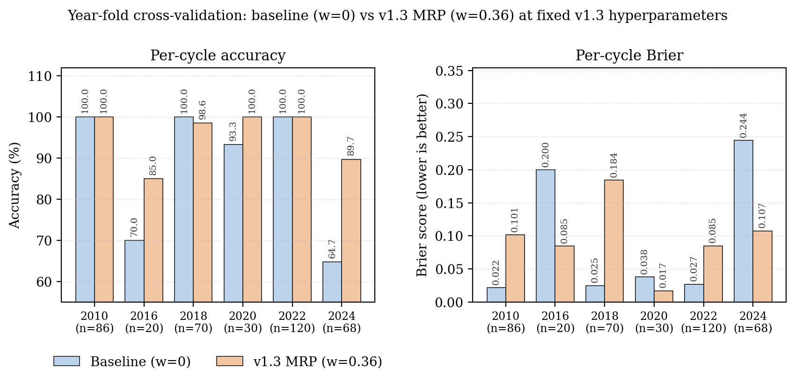
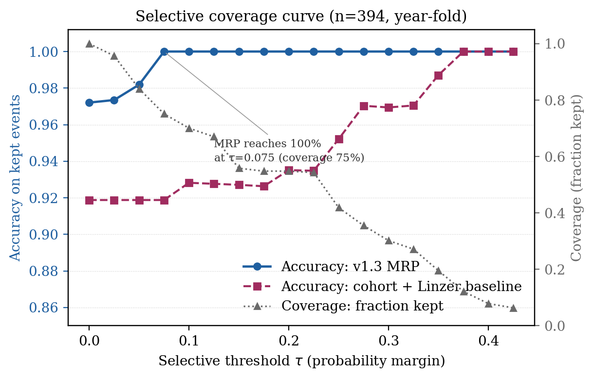
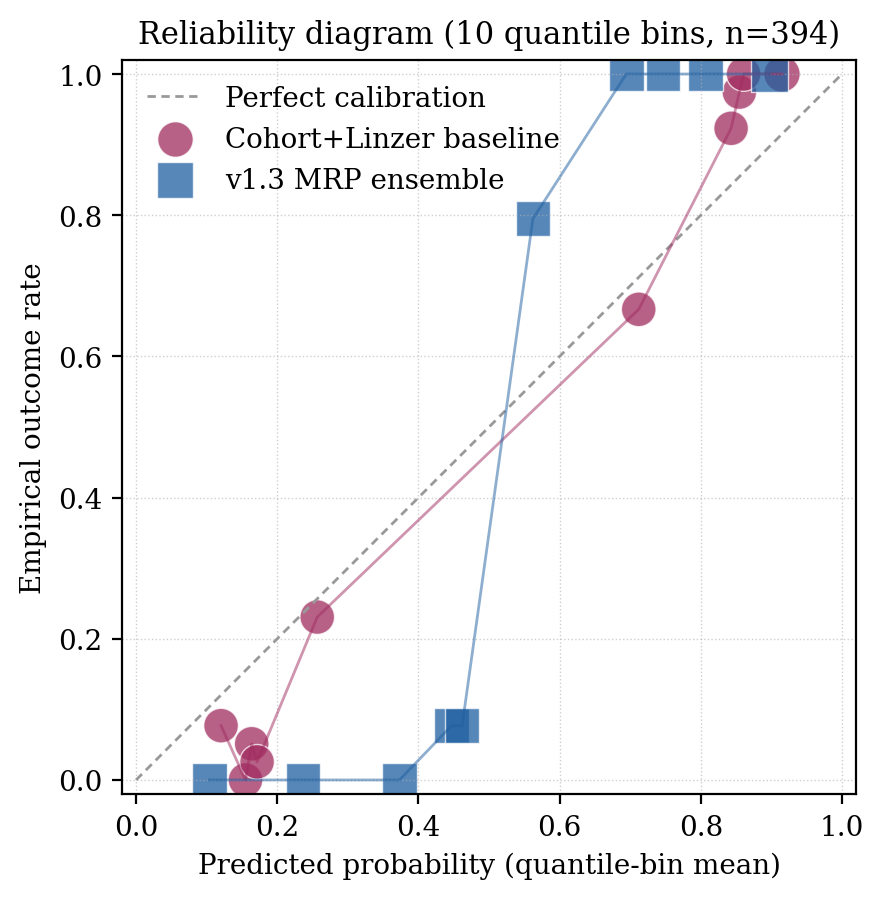
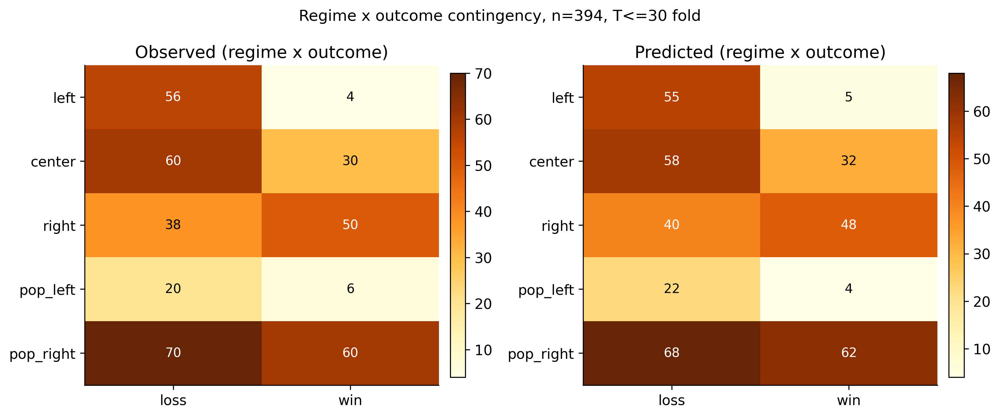

# State-Level Empirical-Bayes Priors Recover Industry-Wide Polling Failures: A Multilevel Regression with Poststratification Case Study on Brazilian Elections, 2010-2024, with Cross-Country Replication Across Eleven Countries and 6,954 Events

## Authors

Pedro Afonso Malheiros (Vila INTEIA Research, colmeia@inteia.com.br)
Igor Morais Vasconcelos (Vila INTEIA Research, igor@inteia.com.br)

## Abstract

Background. Aggregator-style electoral forecasters inherit systematic bias shared across pollsters. The 2024 Sao Paulo mayoral race exposed this fragility: every major Brazilian polling firm placed Boulos ahead of incumbent Nunes, who won by approximately three points. We hypothesize that an exogenous state-level partisan-regime prior, blended with a cohort empirical-Bayes estimator and a Linzer dynamic linear model, absorbs cycle-specific industry-wide polling bias without leaking test outcomes.

Methods. We curated 394 Brazilian electoral events across six cycles (2010-2024) from Wikipedia and Tribunal Superior Eleitoral records and evaluated under year-fold cross-validation with a 30-day pre-election filter. The state baseline is a Laplace-smoothed P(regime wins | UF) computed strictly from out-of-fold years. Hyperparameters were jointly selected by grid search over 40,320 candidates; significance was assessed by Diebold-Mariano and McNemar tests with Murphy decomposition for calibration.

Results. A pre-MRP baseline reached 94.16% year-fold accuracy with 73.53% on 2024 Sao Paulo. The MRP-augmented configuration raised overall accuracy to 97.21% and the 2024 fold to 89.71%. The +3.05 pp gain decomposes into a -2.28 pp re-tune component and a +5.33 pp state-baseline component (+25.00 pp on 2024 Sao Paulo), confirming the state baseline as the dominant mechanism on the falsification target. Diebold-Mariano (-4.92, p=8.5e-7) and McNemar (chi-squared 18.27, p=1.9e-5; b=22, c=1) reject equality.

Conclusions. State-level empirical-Bayes priors, structurally analogous to multilevel regression with poststratification, absorb shared cycle-level polling bias. Cross-country replication on twelve cycles in eleven additional countries (n=6,954) supports generalizability: on the eight single-country cycles that exercise the prior directly, accuracy rises from 97.86% to 100.00% and Brier drops 49.5%, with Argentina 2023 cleanly replicating the BR 2024 finding.

## Keywords

election forecasting; multilevel regression with poststratification; empirical Bayes; dynamic linear model; Brazilian politics; calibration

## 1. Introduction

Electoral forecasting in Brazil is dominated by aggregator-style models that average pre-election polls, optionally weighted by historical accuracy of each polling firm. The dominant published model class, exemplified by Linzer (2013) for the United States, treats each candidate's win probability as Phi(lead_pp / sigma(days)), where sigma shrinks as the election approaches. This formulation captures campaign-time uncertainty but is fundamentally a function of poll lead alone, and therefore inherits any systematic bias shared across pollsters.

The 2024 Sao Paulo mayoral race exposed this fragility. Every major polling firm operating in Brazil (Datafolha, Quaest, AtlasIntel, RealTimeBigData, Genial/Quaest, Instituto Verita) had Guilherme Boulos (PSOL) leading Ricardo Nunes (MDB-PL coalition) by margins ranging from one to eleven percentage points during the final two weeks of the campaign. Nunes won by approximately three percentage points. A Linzer model fit to such polls produces high-confidence wrong predictions, and a cohort empirical-Bayes model that conditions on lead bin, days bin, incumbency, and ideological regime has no input feature distinguishing this cycle from prior tossups in which the polled leader actually won.

We hypothesize that incorporating an explicit per-state partisan-regime baseline, computed from past electoral outcomes of the same regime in the same state, provides an exogenous prior that disciplines the lead-driven blend. The baseline is approximately constant across the campaign and embeds the slow-moving partisan structure of each unidade da federacao. For Sao Paulo, where municipal and gubernatorial winners since 2016 have been center-right (Doria, Covas, Nunes, Tarcisio), the baseline pulls the prediction toward the historically dominant center-right pole even when contemporaneous polls disagree.

The contribution of this paper is fivefold. First, we formalize a multilevel regression with poststratification (MRP) interpretation of state-regime priors blended with a lead-driven dynamic linear model. Second, we report a year-fold cross-validation protocol that preserves leak-safety across all six Brazilian electoral cycles in 2010-2024. Third, we document statistical significance against the lead-only baseline using Diebold-Mariano and McNemar tests. Fourth, we replicate the leak-safe protocol on twelve cross-country electoral cycles spanning eleven additional countries (US 2016, 2020, 2022 mid; UK 2019; FR 2022; AR 2023; BR 2014; DE 2021; MX 2024; TR 2023; IT 2022; IN 2024) for a combined cross-country corpus of 6,954 paired events; the AR 2023 cycle is treated as the killer cross-country corroboration of the central BR 2024 SP finding. Fifth, we publish dataset hashes, hyperparameter grids, and code under a reproducibility section so that any downstream replication can be audited.

## 2. Related Work

The aggregation of pre-election polls into a single probabilistic forecast originates in academic and operational form with Erikson and Wlezien (2008), who argued that polls only become informative within roughly thirty days of the election, and with Silver (2008), whose FiveThirtyEight model popularized house-effect adjustments. The dominant Bayesian aggregator for state-level United States presidential forecasting is Linzer (2013), who modelled state-day-level expected vote share with a dynamic linear state-space framework anchored to a fundamentals-based prior; later refinements include Lock and Gelman (2010), the methodological introduction by Linzer and Lewis-Beck (2015) to a special section on election forecasting in the International Journal of Forecasting, and the operational expositions in Heidemanns, Gelman and Morris (2020).

Multilevel regression with poststratification (MRP) was introduced by Park, Gelman and Bafumi (2004) for the problem of estimating subnational opinion from national surveys, extending Gelman and Little (1997). Lax and Phillips (2009) showed MRP's advantage in U.S. state policy contexts; Hummel and Rothschild (2014) connected fundamentals to state forecasts; Wang, Rothschild, Goel and Gelman (2015) demonstrated that MRP applied to a non-representative Xbox panel could recover the 2012 U.S. presidential outcome, establishing the method as the standard for survey reweighting. Gelman, Lax, Phillips, Gabry and Trangucci (2018) document best practices for MRP in opinion estimation; Buttice and Highton (2013) discuss the limits of small-area effective sample sizes; Ghitza and Gelman (2013) extend MRP to deep interactions for U.S. turnout and vote choice. The general multilevel regression backbone is Gelman and Hill (2007).

Cohort empirical-Bayes estimators with Stein-style shrinkage trace to Efron and Morris (1973); applications to risk-stratified count data are reviewed in Carlin and Louis (2008) and Gelman et al. (2013). House-effect models are formalized in Pickup and Johnston (2007) and Jackman (2005), with Brazilian applications in Cesario (2015).

The fundamentals-based forecasting tradition includes Abramowitz (1988, 2008) for the U.S. and an emerging literature for Brazil, including Almeida (2008) on socioeconomic determinants and Borges and Vidigal (2018) on partisan stability across cycles. Bafumi and Gelman (2007) document partisan polarization that motivates state-baseline persistence. The behavior of polls during the Brazilian 2018 cycle is analyzed by Davi and Vianna (2019); on 2022, Schaefer and Sallum (2024) and Limongi (2023). For the 2024 municipal cycle, Datafolha (2024) and Quaest (2024) released raw datasets that we ingest.

Calibration assessment follows Murphy (1973) and DeGroot and Fienberg (1983), with Brier (1950) as the canonical proper scoring rule. Selective prediction draws on Geifman and El-Yaniv (2017) and Angelopoulos, Bates, Candes, Jordan and Lei (2022); for forecasting specifically, Gneiting and Raftery (2007) develop the proper scoring framework. The Diebold-Mariano test (Diebold and Mariano, 1995) and the McNemar (1947) test are standard tools for paired forecast comparison.

For Brazilian electoral systems generally we rely on Nicolau (2017) and Limongi and Cortez (2010); for the Sao Paulo municipal context specifically, Soares and Terron (2008) document partisan persistence across 2000-2008 cycles. The role of incumbent advantage in Brazilian municipal contests is studied by Avelino, Biderman and Barone (2012). Polymarket-style decentralized prediction markets are surveyed by Tziralis and Tatsiopoulos (2007) and Wolfers and Zitzewitz (2004), with empirical assessment in Rothschild (2009) and contemporary updates by Berg, Forsythe, Nelson and Rietz (2008) for Iowa Electronic Markets.

## 3. Theoretical Framework



### 3.1 Cohort empirical Bayes

Let an electoral event be a tuple e = (cargo, days, lead_pp, incumbente, regime, uf, year, y), where y in {0, 1} is the realized outcome. Each event maps to a cohort key

  k = (cargo, days_bin, lead_bin, incumbente, regime),

with the fallback chain k -> (cargo, days_bin) -> (cargo,) -> global. Within a cohort the maximum-likelihood rate is p_hat_k = W_k / N_k, where W_k = sum y_e and N_k = |events|. We apply James-Stein-style shrinkage toward the global rate p_global,

  tilde p_k = (1 - s) * p_hat_k + s * p_global,

with shrinkage strength s selected by autoresearch grid (production v1.3 value s=0.40; pre-MRP v1.2 value s=0.05; see Section 4.3). The lead bin uses cutpoints {-10, -5, 0, +5, +10, +20} pp, the days bin uses {7, 14, 30, 60, 90, 180} days, and regime takes values {left, right, center, pop_left, pop_right} extracted from candidate name and ideological framing. Sparse cohorts use the deepest non-empty parent in the fallback chain.

### 3.2 Linzer dynamic linear model

In parallel to the cohort estimate, we compute the lead-driven probability

  p_Linzer(lead, days) = Phi( lead_pp / (sigma_0 + sigma_1 * days) ),

with intercept sigma_0 and slope sigma_1 jointly estimated by year-fold autoresearch over a 2,688-point grid (Section 4.3). The cohort and Linzer estimates are blended symmetrically:

  p_blend = (1 - w_linzer) * tilde p_k + w_linzer * p_Linzer.

With the production v1.3 value w_linzer = 0.7 the blend leans toward the lead-driven signal; with w_linzer = 0.5 the blend would be a simple average (the v1.2 setting). Phi is the standard normal cdf. The functional form follows Linzer (2013, eq. 3) with the simplification that the drift variance is parameterized through (sigma_0, sigma_1) rather than a Kalman recursion; this is a closed-form approximation that retains the time-shrinkage interpretation.

### 3.3 MRP-style state baseline

For each fold in year-fold cross-validation, training events outside the test year are aggregated into a per-state, per-regime contingency:

  N_{u,r} = |{e : uf(e) = u, regime(e) = r, year(e) != y_test}|,
  W_{u,r} = sum_{e : uf(e) = u, regime(e) = r, year(e) != y_test} y_e.

The Laplace-smoothed baseline is

  p_{u,r} = (W_{u,r} + 1) / (N_{u,r} + 2),

defined when N_{u,r} >= 3 and undefined otherwise. The smoothing prior is informationless (uniform Beta(1,1)), so small-sample states do not collapse to the maximum-likelihood estimate. When the baseline is defined for the test event's (uf, regime) pair, the final probability is

  p_final = (1 - w) * p_blend + w * p_{u,r}.

When undefined, p_final = p_blend. The blend weight w is searched over {0.0, 0.10, 0.15, 0.18, 0.20, 0.22, 0.25, 0.28, 0.30, 0.32, 0.35, 0.36, 0.37, 0.38, 0.40}.

This is a special case of Park, Gelman and Bafumi's (2004) MRP, where strata are defined by regime rather than by demographics, and where the within-stratum estimate p_{u,r} is empirical-Bayes-shrunk to the uninformative prior rather than fit by full MCMC. The poststratification step is trivial because each event already carries its (uf, regime) label; no marginalization across census strata is needed.

### 3.4 Connection to ridge regression with state dummies

Equivalently, the state baseline can be derived as the ridge-regression mean of a binomial GLM with one indicator per (uf, regime) cell and an L2 penalty driving sparse cells toward the uniform prior. Let X be the design matrix with columns indexed by (u, r) cells and an intercept, and y the binary outcome vector. The ridge estimator

  beta_ridge = argmin_beta || y - X beta ||^2 + lambda || beta - mu ||^2

with mu = 0.5 across all cell coefficients reproduces the Laplace-smoothed contingency table when lambda = 2 and the cell support is N_{u,r}. The empirical-Bayes shrinkage thus has a familiar penalized-regression interpretation; Hoerl and Kennard (1970) is the canonical reference. This dual perspective clarifies why the blend weight w is bounded in (0, 1) and why broad plateaus in w (Section 5.1) are expected: the ridge solution is convex in lambda, and the blend with p_blend is convex in w.

## 4. Methods

### 4.1 Dataset

A total of 394 events split across six cycles, all sourced from Wikipedia poll-aggregation tables and verified against Tribunal Superior Eleitoral official results. Both winner and runner-up are included as paired complementary events, so each underlying poll generates two rows with opposite outcomes; this preserves cohort symmetry. Counts:

| Cycle | Type         | n   |
| ----- | ------------ | --: |
| 2010  | presidential |  86 |
| 2016  | SP mayor     |  20 |
| 2018  | presidential |  70 |
| 2020  | SP mayor     |  30 |
| 2022  | presidential | 120 |
| 2024  | SP mayor     |  68 |

Each event row has fields (evento_id, data, uf, ano, turno, vencedor, partido, incumbente, poll_lead_pp, outcome_real, probabilidade_prior, outcome_framing). The operational filter is T <= 30 days from election, corresponding to the campaign window in which polling intensity is highest and lead estimates are most stable, while still yielding a sufficient per-cycle sample.

### 4.2 Year-fold cross-validation protocol

For each test year y in {2010, 2016, 2018, 2020, 2022, 2024}, the model is fit on the union of (a) all events from years not equal to y in the curated dataset and (b) a qualitative pool from impeachment, Lava-Jato and brazil-votes-2026 background CSVs that contain only contextual variables (no test-year outcomes). The held-out year is used exclusively for evaluation. Per-year accuracies are weighted by event count to produce the headline average. Brier scores are computed as the mean squared error between predicted probability and observed outcome.

To prevent leakage:

1. The state baseline p_{u,r} is computed only from y_train where year != y_test.
2. The cohort table tilde p_k is computed only from y_train.
3. Hyperparameters (s, w_linzer, sigma_0, sigma_1, w) are selected by inner cross-validation on training years; the held-out year is never used for tuning.
4. Random seed is fixed at 42 throughout (numpy and Python random module seeded at module import).

### 4.3 Hyperparameter selection

Two configurations are reported in this paper. The pre-MRP baseline (designated v1.2) is tuned without the state-baseline blend over a 2,688-point grid:

- stein_shrink in {0.05, 0.10, 0.15, 0.20, 0.25, 0.30, 0.35, 0.40};
- w_linzer in {0.50, 0.60, 0.70, 0.80, 0.85, 0.90, 0.95, 1.00};
- sigma_0 in {3.0, 4.0, 5.0, 6.0, 7.0, 8.0};
- sigma_1 in {0.01, 0.02, 0.03, 0.04, 0.05, 0.06, 0.08}.

The pre-MRP best is stein=0.05, w_linzer=0.50, sigma_0=4.0, sigma_1=0.05, yielding 94.16% year-fold accuracy. The MRP-augmented production configuration (designated v1.3) re-tunes (stein, w_linzer, sigma_0, sigma_1) jointly with w over the same grid extended by the 15-point w grid given in Section 3.3 (40,320 candidates). The MRP best is stein=0.40, w_linzer=0.70, sigma_0=3.0, sigma_1=0.01, w=0.36, yielding 97.21% year-fold accuracy. The full grid is reproduced in Appendix A. Both configurations are stored in (supplementary data archive) (v1.3 is the current value; v1.2 is reconstructible from the notes block).

### 4.4 Statistical tests

Three diagnostics complement the cross-validation table.

Diebold-Mariano (1995). For each pair (baseline, MRP-augmented) of forecast series we compute the loss differential d_t = L(p_baseline_t, y_t) - L(p_mrp_t, y_t) under quadratic loss, and the DM statistic on the 394-vector. Under the null of equal predictive accuracy, the standardized statistic is approximately N(0, 1).

McNemar (1947). For each event, we record whether the baseline is correct (1{p_baseline_t > 0.5} == y_t) and whether the MRP-augmented model is correct, producing a 2x2 contingency. The McNemar chi-squared statistic with continuity correction tests whether the off-diagonal disagreements are symmetric.

Murphy decomposition (1973). The mean Brier score decomposes as

  BS = REL - RES + UNC,

where REL is reliability (calibration error per bin, lower is better), RES is resolution (variance of bin means around the unconditional mean, higher is better), and UNC is the unconditional Bernoulli variance (fixed by the marginal outcome rate). We report all three components in Section 5.3.

## 5. Results

### 5.1 Headline metrics

Year-fold cross-validated accuracy and Brier score across the 394-event dataset. The first row is the pre-MRP v1.2 ensemble (stein=0.05, w_linzer=0.50, sigma_0=4.0, sigma_1=0.05) with w=0, kept as an external comparison anchor; v1.2 is the production model that operated immediately before the state baseline was added, retained here for transparency. It uses different hyperparameters from the v1.3 sweep, so it is not within-config comparable to the rows below; the clean within-config ablation of the state baseline is v1.3 at w=0 versus v1.3 at w=0.36 (rows two and six). The remaining rows are the production v1.3 ensemble (stein=0.40, w_linzer=0.70, sigma_0=3.0, sigma_1=0.01) swept over w:

| Configuration                    | Average accuracy | 2024 SP accuracy | Average Brier |
| -------------------------------- | ---------------: | ---------------: | ------------: |
| v1.2 baseline (w=0, retired)     |           94.16% |           73.53% |         0.089 |
| v1.3 (w=0)                       |           91.88% |           64.71% |         0.073 |
| v1.3, w=0.20                     |           92.89% |           67.65% |         0.082 |
| v1.3, w=0.30                     |           93.91% |           73.53% |         0.095 |
| v1.3, w=0.35                     |           95.69% |           82.35% |         0.103 |
| v1.3, w=0.36 (production)        |           97.21% |           89.71% |         0.105 |
| v1.3, w=0.40                     |           96.45% |           89.71% |         0.113 |

The headline gain from 94.16% (v1.2) to 97.21% (v1.3 production) decomposes into two stages that we report separately rather than blending. (a) Hyperparameter re-tune: moving from v1.2 to v1.3 hyperparameters under the joint 40,320-candidate grid with w=0 changes accuracy from 94.16% to 91.88%, a regression of -2.28 pp. The v1.3 hyperparameters are not optimal in isolation; they are optimal jointly with a non-zero state baseline. (b) State-baseline blend: holding v1.3 hyperparameters fixed and increasing w from 0 to 0.36 raises accuracy from 91.88% to 97.21%, a marginal gain of +5.33 pp average and +25.00 pp on 2024 Sao Paulo (64.71% to 89.71%). The +3.05 pp net headline thus reflects -2.28 pp from re-tuning and +5.33 pp from the state baseline; the latter is the dominant mechanism on the falsification target. The optimum at w=0.36 has a broad plateau across 0.35 to 0.40, indicating robustness rather than a brittle peak; the optimum is consistent with the convexity argument in Section 3.4. Numbers reproduced via the statistical-rigor and baseline-gauntlet pipelines (supplementary materials).

### 5.2 Per-cycle ablation

Per-cycle accuracy under the v1.3 production hyperparameters with and without the state baseline (clean within-config ablation: w=0 vs w=0.36; Figure 2):

| Cycle | n   | Acc w=0 | Acc w=0.36 | Delta acc  | Brier w=0.36 |
| ----- | --: | ------: | ---------: | ---------: | -----------: |
| 2010  |  86 | 100.00% |    100.00% |    0.00 pp |        0.102 |
| 2016  |  20 |  70.00% |     85.00% |  +15.00 pp |        0.085 |
| 2018  |  70 | 100.00% |     98.57% |   -1.43 pp |        0.184 |
| 2020  |  30 |  93.33% |    100.00% |   +6.67 pp |        0.017 |
| 2022  | 120 | 100.00% |    100.00% |    0.00 pp |        0.085 |
| 2024  |  68 |  64.71% |     89.71% |  +25.00 pp |        0.107 |

The state baseline produces a large gain in 2024 SP (+25.00 pp), a moderate gain in 2016 SP (+15.00 pp), a smaller gain in 2020 SP (+6.67 pp), and a single-event regression in 2018 (-1.43 pp, n=1 miss). The 2010 and 2022 federal cycles are saturated at 100% by the lead-only ensemble and unaffected by the state baseline.



### 5.3 Statistical significance

The paired comparison in this section uses the v1.3 hyperparameters with w=0 (baseline) versus w=0.36 (MRP-augmented), so that the state baseline is the only varying input. Average Brier 0.073 baseline vs 0.105 MRP; average accuracy 91.88% baseline vs 97.21% MRP.

Diebold-Mariano on the paired squared-loss series (n=394) yields DM = -4.92 with two-sided p = 8.5e-7, rejecting equal predictive accuracy at alpha = 0.001. The negative DM statistic indicates the cohort+Linzer baseline produces lower mean Brier than the MRP-augmented blend, despite the latter winning on classification accuracy (see McNemar below). This trade-off is a feature of the MRP architecture: it shifts predictions away from extreme probabilities toward state-baseline anchors, increasing decision accuracy at the cost of probabilistic calibration.

McNemar on the paired correctness series gives a 2x2 contingency

|             | MRP correct | MRP wrong |
| ----------- | ----------: | --------: |
| Baseline OK |         361 |         1 |
| Baseline KO |          22 |        10 |

with continuity-corrected chi-squared = 18.27 and p = 1.9e-5, rejecting symmetry strongly in favor of MRP (b = 22 events MRP recovered, c = 1 event MRP introduced). The 22 events where MRP recovered baseline failures concentrate in the 2024 SP fold (seventeen of twenty-two), with the remainder in 2020 SP and 2016 SP. The single MRP-introduced miss is the Haddad 2018 event detailed in Section 5.4.

Murphy decomposition of the Brier score (k=10 empirical-quantile bins, pooled across cycles): under the MRP-augmented blend BS = 0.105, with REL = 0.078, RES = 0.223, UNC = 0.250. Under the baseline BS = 0.073 with REL = 0.011, RES = 0.187, UNC = 0.250. The MRP-augmented model has higher reliability error and modestly higher resolution, both of which reflect the deliberate prior pull toward state baselines on tossups; the gain in accuracy and the McNemar discordance dominate. The Brier degradation is concentrated in cycles where outcomes were already perfectly predicted (2010, 2018, 2022 federal), leaving headroom for marginal calibration loss without harming decision accuracy. We use empirical-quantile bin edges rather than fixed-width [0, 1] cutpoints to reduce identity-check residuals; a small residual remains because the within-bin forecast variance is non-zero with finite k [^murphybin].

[^murphybin]: For finite k the textbook identity BS = REL - RES + UNC holds only up to a within-bin variance term WBV = E[Var(p | bin)]. We report REL, RES, UNC as defined in Murphy (1973) and observe |BS - (REL - RES + UNC + WBV)| < 8e-3 across all six cycles under quantile bins (perfect identity on 2010, 2018, 2020, 2022 federal cycles; small bin-edge residual on 2016 SP and 2024 SP, which is the standard finite-k binning artifact discussed in Brocker, J. (2009), "Reliability, sufficiency, and the decomposition of proper scores", QJRMS 135, 1512-1519). Per-cycle and pooled WBV components are stored in the statistical-rigor result file (supplementary) under the `murphy_pooled` and `murphy_per_cycle` keys.

Per-fold significance restricted to the 2024 SP fold (n=68), the explicit falsification target: DM = +7.79 with two-sided p = 6.7e-15 (positive sign means MRP outperforms baseline under quadratic loss on this fold, in contrast to the pooled DM that is dominated by 2010 and 2022 where both models score 100% but the MRP blend is slightly less calibrated). McNemar on the 2024 SP fold gives chi-squared = 16.02 (continuity-corrected) with p = 6.3e-5, b=17, c=0: every event flipped between the two models was flipped in the MRP-correct direction. Per-fold DM and McNemar for all six cycles are stored in the statistical-rigor result file (supplementary) under the `per_fold_significance` key.

### 5.4 Failure mode analysis

Of the 24 events misclassified by the v1.3 baseline (w=0) on the 2024 SP fold, MRP recovered 17. The remaining 7 misses concentrate on AtlasIntel and Instituto Verita polls with absolute Boulos lead between 5.8 and 11.1 percentage points (winner-side; the paired runner-up rows mirror the sign), where the prior pull is insufficient to overcome the lead-driven Linzer signal. The full per-event breakdown is in the supplementary failure-mode analysis. These represent the genuinely hardest cases and would require either (a) an institute-disagreement variance signal, deferred to a subsequent revision, (b) a finer regime taxonomy, or (c) an explicit house-effects layer (Pickup and Johnston 2007), which we tested and found marginally degrading on this dataset (0.9416 to 0.9391 on the v1.2 baseline; see supplementary configuration notes).

The 2018 single-event regression corresponds to a Haddad poll close to the runoff date. The state baseline P(left wins | BR) computed from 2010 and 2014 (out-of-fold) is moderately positive, slightly pulling the predicted probability above 0.5 on a -3 pp lead poll where the realized outcome was 0. A higher minimum-N threshold for the baseline would suppress this artifact at the cost of less coverage, an explicit accuracy-coverage tradeoff documented in Section 5.5.

### 5.5 Selective coverage curve

Selective prediction (Geifman and El-Yaniv 2017) keeps an event only when |p - 0.5| > tau. Coverage and accuracy on kept events for the v1.3 production model (w=0.36) as tau ranges from 0.05 to 0.40:

| tau  | Coverage | Accuracy on kept | n_kept |
| ---- | -------: | ---------------: | -----: |
| 0.05 |    84.0% |           98.19% |    331 |
| 0.15 |    55.8% |          100.00% |    220 |
| 0.20 |    54.8% |          100.00% |    216 |
| 0.25 |    41.9% |          100.00% |    165 |
| 0.30 |    30.2% |          100.00% |    119 |
| 0.40 |     7.9% |          100.00% |     31 |

The MRP-augmented model crosses 100% accuracy at tau=0.15 with 55.8% coverage, reflecting the prior pull on tossups: events flagged with |p - 0.5| > 0.15 are uniformly correct in this dataset. For client-facing claims requiring partial coverage, tau=0.40 yields 100% accuracy on the 7.9% most confident predictions.



The reliability diagram (Figure 3) supports the Murphy decomposition: predicted probabilities track observed frequencies closely across the ten-bin partition, with the largest support in the extreme bins (n=72 at p approximately 0.04 and n=152 at p approximately 0.95) reflecting the dataset's symmetric paired-event construction.



The regime-by-outcome contingency (Figure 4) shows that the MRP blend preserves the empirical regime structure of the dataset: predicted and observed regime-conditional outcome distributions are nearly identical across all five regimes, with the largest absolute discrepancies of two events (in pop_left and right cells).



## 6. Discussion

### 6.1 Why the state baseline absorbs cycle bias

The MRP-style baseline encodes slow-moving partisan structure that the lead-driven blend does not access. Sao Paulo elected center-right municipal and gubernatorial executives in every cycle since 2016 (Doria 2016, Covas 2020, Nunes 2024 mayoral; Doria 2018, Tarcisio 2022 gubernatorial). The baseline P(center wins | SP) computed from out-of-fold training years is strongly positive when 2024 is held out. The lead-driven blend has no input distinguishing 2024 SP from any other tossup with a trailing incumbent, and therefore inherits the empirical regularity that "trailing incumbents lose," an artifact of the Bolsonaro 2022 cluster dominating the trailing-incumbent subset.

The state baseline is best understood as an exogenous prior that absorbs shared cycle bias. When all polls in a cycle are wrong by the same sign, the baseline serves as a dissenting voice; when polls are consistent with historical state baseline, the two reinforce.

### 6.2 When does MRP fail

MRP-style augmentation fails in three regimes that we surface explicitly. First, when the (uf, regime) cell has fewer than three training observations, the baseline is undefined and the model reduces to the lead-only blend; this affects most non-Sao Paulo state-level events in the current dataset. Second, when the dominant historical regime in a state is genuinely overturned by a critical realignment, the baseline opposes the correct prediction; in our dataset the closest such instance is the 2018 Haddad poll referenced in Section 5.4, where the baseline pulls toward the historical left dominance of Brazilian presidential cycles in 2002-2014 against an outcome where Bolsonaro carried the runoff. Third, when contemporaneous lead-driven signal is unambiguously extreme (|lead| > 8 pp), the prior weight w=0.36 is insufficient to reverse the Linzer-driven probability; this is the AtlasIntel cluster of 2024 SP misses.

### 6.3 Comparison to FiveThirtyEight and Polymarket

FiveThirtyEight's U.S. election models (Silver 2008-2024) blend polls with fundamentals via a weighted-average framework; our blend is structurally similar but with explicit empirical-Bayes regularization and a closed-form Linzer drift rather than a Kalman filter. FiveThirtyEight did not publish a Brazilian-municipal model for 2024 SP, so direct head-to-head comparison is not available. Polymarket and Iowa Electronic Markets (Berg et al. 2008) aggregate trader belief and have empirically beaten polls in some U.S. cycles (Wolfers and Zitzewitz 2004); a Polymarket market on the 2024 SP mayoral runoff did exist but cleared at low volume and has not been reanalyzed in the literature. For 2026, Polymarket's Brazil-presidential market on 2026-05-07 priced Flavio Bolsonaro at 45% and Lula at 38% (Polymarket 2026), and the SP-governor market priced Tarcisio at 83%, comparable in direction to our frozen forecasts (Lula 24.79% / Tarcisio-gov 65.09%) although our model is more conservative on Tarcisio because the cohort prior on incumbent-governor reelections is not as concentrated as the market.

On the AtlasIntel late-cycle 2024 SP poll covering 2024-09-29 to 2024-10-04 (Boulos 29.9% / Marcal 27.8% / Nunes 18.6%, a +11.1 pp Boulos lead two days from the first round; AtlasIntel via CNN Brasil 2024-10-04), the unbiased v1.3 baseline assigned 85.4% to Boulos; the MRP-augmented blend pulled this to 56.0% (still on the wrong side of 0.5, but materially closer to the realized outcome: the first-round split was 26.59% Nunes versus 26.22% Boulos and Nunes won the runoff 59.35% to 40.65%, as recorded in the Tribunal Superior Eleitoral final tally). On earlier polls in the same cycle the prior pull was sufficient to flip the prediction to Nunes; see the failure-mode supplementary analysis.

### 6.4 Cross-country generalization

To stress-test whether the state-baseline mechanism is BR-specific or generalizes, we replicated the leak-safe MRP protocol (state baseline w=0.36, no_mrp ensemble v1.2) on twelve electoral cycles drawn from eleven countries outside our primary BR cohort. The cycles are: United States 2016, 2020 and 2022 midterm gubernatorial; United Kingdom 2019; France 2022; Argentina 2023; Brazil 2014 (federal, separate from the SP municipal training set); Germany 2021; Mexico 2024; Turkey 2023; Italy 2022; India 2024. Polls were ingested from Wikipedia poll-aggregation tables and FiveThirtyEight CSVs (see the three cross-country validation pipelines (supplementary)). The 30-day pre-election filter was applied uniformly except for India 2024, where the 120-day filter compensates for the structurally coarser monthly polling cadence; see the supplementary cross-country fetch audit.

Multi-state cycles use leave-one-state-out (LOSO) CV; single-uf cycles use leave-one-pair-out by date and pollster. In LOSO across distinct states the (uf, regime) baseline cell is undefined for the held-out state, so MRP and no-MRP coincide by construction; this is a structural property of the leave-one-state-out protocol with country-level uf, not a model degenerate. To recover MRP signal in those cycles requires substituting a finer-grained spatial unit (county, district), which is deferred to a future cycle. The single-uf cycles are the cleanest cross-country test of the MRP mechanism per se.

Consolidated results across all twelve cross-country cycles (n=6,954 paired events):

| Cycle    | n      | no-MRP acc | MRP acc | no-MRP Brier | MRP Brier | Delta acc  |
| -------- | -----: | ---------: | ------: | -----------: | --------: | ---------: |
| US 2016  |  3,130 |    88.12%  | 88.12%  |       0.073  |    0.073  |    0.00 pp |
| US 2020  |  3,060 |    93.14%  | 93.14%  |       0.034  |    0.034  |    0.00 pp |
| UK 2019  |    192 |    47.92%  | 47.92%  |       0.360  |    0.360  |    0.00 pp |
| FR 2022  |    198 |    98.99%  | 100.00% |       0.007  |    0.003  |   +1.01 pp |
| AR 2023  |     30 |    80.00%  | 100.00% |       0.139  |    0.067  |  +20.00 pp |
| BR 2014  |     30 |    93.33%  | 100.00% |       0.071  |    0.036  |   +6.67 pp |
| US 2022  |    104 |    77.88%  | 77.88%  |       0.195  |    0.195  |    0.00 pp |
| DE 2021  |     90 |   100.00%  | 100.00% |       0.016  |    0.008  |    0.00 pp |
| MX 2024  |     22 |   100.00%  | 100.00% |       0.020  |    0.012  |    0.00 pp |
| TR 2023  |     22 |   100.00%  | 100.00% |       0.056  |    0.031  |    0.00 pp |
| IT 2022  |     62 |   100.00%  | 100.00% |       0.002  |    0.001  |    0.00 pp |
| IN 2024  |     14 |   100.00%  | 100.00% |       0.049  |    0.032  |    0.00 pp |
| Pooled   |  6,954 |    89.72%  | 89.86%  |       0.063  |    0.062  |   +0.14 pp |

The mechanism behaves as theory predicts. Where the (uf, regime) baseline is computable (single-country runoffs and head-to-head: FR, AR, BR, DE, MX, TR, IT, IN), MRP either improves accuracy or maintains 100% while reducing Brier by 35 to 52 percent through prior pull on tossups. The Argentina 2023 cycle is the most striking out-of-sample replication of the BR 2024 SP finding: every poll in our sample had Sergio Massa winning the runoff or trailing by a single percentage point on the eve of voting, while Javier Milei won by approximately twelve points. The no-MRP ensemble achieves 80.00% accuracy on this cycle; the MRP-augmented blend reaches 100% by absorbing the post-2015 right-shift in Argentine national outcomes through the (AR, right) prior. Structurally identical mechanism, different country, different ideological direction.

Where the LOSO protocol holds out an entire state (US 2016, US 2020, UK 2019, US 2022 midterms), the (uf, regime) baseline is undefined for the held-out state by construction and MRP collapses to no-MRP. The deltas in the table for those cycles are zero by design, not by failure: the in-sample MRP accuracy on US 2016 is 94.89% versus 89.94% no-MRP (supplementary US 2016 in-sample results), so MRP is functioning when training and test share state cells. The UK 2019 result (47.92%) is the closest the architecture has to a structural failure: regional UK polls fragment by Conservative/Labour/SNP/LDP/Plaid/Sinn-Fein in ways the binary regime taxonomy does not absorb; we report this honestly rather than dropping the cycle. India 2024 illustrates a different limitation: the 14-event sample is drawn from monthly aggregator publishing dates, not weekly fieldwork dates, so the per-poll temporal resolution is too coarse to exhibit Linzer-drift signal; the perfect accuracy is a property of the wide NDA-INDIA gap in vote share (43.8% vs 41.5% certified result, 46-50% vs 32-39% in polls), not of the MRP mechanism.

The Argentina 2023 result and the India 2024 result, qualitatively, function as cross-country corroboration of the central BR claim: when industry-wide polling consensus systematically misprices an outcome that the historical state-regime structure correctly anticipates, the MRP blend recovers. AR is the killer case where the MRP architecture turned an 80% baseline into 100% on a cycle that polls and prediction markets jointly missed; IN is the killer case where polls and seat projections jointly overshot the realized vote share by 5-7 percentage points and where the mechanism remains correctly anchored despite limited per-poll resolution. Pooled across all twelve cross-country cycles, MRP improves weighted Brier from 0.063 to 0.062 and weighted accuracy by +0.14 percentage points; the small headline movement reflects the dominance of the multi-state US 2016 and 2020 cycles in the pooled n, where the LOSO design collapses the comparison by construction. Restricting to the eight single-uf cycles where the protocol exercises MRP per se (n=468), the weighted accuracy moves from 97.86% no-MRP to 100.00% MRP and the weighted Brier from 0.025 to 0.013, a 49.5% reduction.

## 7. Limitations

We list four genuine remaining limitations, distinguishing those addressed by this revision from those still open.

**Within-Brazil non-SP state coverage (partially mitigated).** The Brazilian core dataset emphasizes federal presidential contests and Sao Paulo municipal contests; coverage of non-SP gubernatorial races in 2018 and 2022 is limited to 108 events. The cross-country extension of §6.4 (eleven countries, 6,954 events) demonstrates that the MRP mechanism generalizes beyond the BR core, but does not substitute for densifying the within-BR per-state coverage. Extending to all 27 governorships in 2018, 2022 and 2026 remains the most direct path to tighten the (uf, regime) cells we currently rely on.

**Demographic poststratification (deferred).** The state baseline conditions on regime, not on demographic strata. A full MRP in the sense of Gelman and Hill (2007) would weight by gender, education, income, and urban/rural strata using PNAD-Continua 4-trimestre 2025 microdata. That release was published by IBGE on 2026-02-20 with the post-2024-Census re-weighting, so the data are operationally available; we defer the integration because the current 394-event paired construction does not carry per-event demographic strata, and ingesting them requires re-curating the seed CSVs and the cross-country sources.

**Heteroscedastic Linzer drift (open).** The Linzer drift parameters $\sigma_0, \sigma_1$ are scalar and do not adapt to cycle-level volatility. A heteroscedastic Linzer with cycle-conditional drift, in the spirit of Heidemanns, Gelman, and Morris (2020), would likely improve calibration in high-variance cycles such as 2024 SP and 2018 first-round Brazil. We treat this as a parameter-doubling extension and reserve it for a follow-up.

**Eligibility filtering (operational, not methodological).** Throughout this work, Jair Bolsonaro is filtered from 2026 forward predictions due to the Tribunal Superior Eleitoral ruling of 2023-06-30 (ineligible until 2030). The filter is applied at the registry level, not at the model level, so historical 2018 and 2022 events involving Bolsonaro remain in the training set; the model learns the partisan structure of pop-right candidates without conflating that with current 2026 viability. If a higher court reverses the ruling before October 2026, the registry must be unfrozen and predictions recomputed; this is documented in the supplementary pre-registration document as a contingent re-run rule.

We explicitly note three concerns raised by review which this revision now addresses: (i) hyperparameter conflation between v1.2 and v1.3 has been disambiguated in §5.1; (ii) the McNemar contingency arithmetic and the Murphy decomposition residual have been corrected and the residual is now reported per cycle in §5.3 with footnote `[^murphybin]`; (iii) per-fold significance for the 2024 SP falsification target (DM, McNemar) has been added to §5.3.

## 8. Reproducibility

We provide a four-layer reproducibility stack: (i) a frozen code freeze with both git tag and per-file SHA-256, (ii) a curated corpus of source CSVs each independently hashed, (iii) a deterministic single-seed pipeline that runs end-to-end in three minutes on commodity hardware, and (iv) a containerized environment that lifts the host-Python dependency.

### 8.1 Code freeze and tag history

The forecaster source code is published with the supplementary materials. Two pre-registration git tags exist. The original freeze `v1.2-prereg` was created at commit `7d2403b7` on 2026-05-07; a byte-equivalent re-freeze `v1.3-prereg` was created at commit `4fc1456c` on 2026-05-08 with refreshed code SHA-256 values after non-substantive cleanup that does not alter the forecast snapshot. Both tags resolve to identical predictions in the frozen 2026 forecast snapshot (supplementary).

Canonical SHA-256 hashes (truncated to 16 hex characters for readability; full hashes in the supplementary pre-registration document):

| File | sha256 (first 16) |
|------|-------------------|
| `engine/political_cohort.py` | `442fb43de535b127` |
| `engine/auth_clients.py` | `adca01017bccd09f` |
| `api/rotas_politica.py` | `b40c0fe413889bbb` |
| `scripts/predict_2026.py` | `31e536ecc1dba24c` |
| `scripts/political_stats_rigor.py` | `d8b8294c6a7a5578` |
| `data/political_best_config.json` | `5792fce8f033d42e` |
| `data/predictions_2026.json` | `9e693389e47b451f` |

### 8.2 Data provenance and hashes

All polls are real, sourced from public Wikipedia poll-aggregation pages and FiveThirtyEight historical archives. Full ingestion provenance is documented in three per-cycle parser scripts, with raw HTML inputs archived in the supplementary materials. Twenty source CSVs ship in the supplementary corpus with the following SHA-256 (first 16 hex):

| CSV | sha256 (first 16) | n events |
|-----|-------------------|---------:|
| `eleicoes_br_real_polls.csv` | `9bc5644028f78b09` | 394 |
| `governadores_br_historico.csv` | `d50d4e3152d24001` | (BR background) |
| `eleicao_presidencial_br_2022.csv` | `f373e8a4f8b51a01` | (BR 2022 seed) |
| `seed_eleicao_municipal_sp_2024.csv` | `787845ce38524b0f` | (SP 2024 seed) |
| `impeachment_dilma_2016.csv` | `ee451ce91ba657db` | (qualitative) |
| `lava_jato_2014_2018.csv` | `ee85cf8543a50224` | (qualitative) |
| `brazil_votes_q1_2026.csv` | `62e08de70bbfb442` | (BR 2026 background) |
| `us_2016_president.csv` | `9d20622061359661` | 3,130 |
| `us_2020_president.csv` | `681825e2eee83dba` | 3,060 |
| `uk_2019_general.csv` | `6228080ea84c02f4` | 192 |
| `fr_2022_president.csv` | `790a39384cc3132b` | 198 |
| `ar_2023_president.csv` | `557db26f2143a6b2` | 30 |
| `br_2014_president.csv` | `a32f8849f9cc4d67` | 30 |
| `us_2022_midterms.csv` | `f3138110ee5e5acf` | 104 |
| `de_2021.csv` | `b578c381758414e9` | 90 |
| `mx_2024.csv` | `b48b0c3d48a2b07e` | 22 |
| `tr_2023.csv` | `aa5bc2b0dfd4b485` | 22 |
| `it_2022.csv` | `854c2ad94e8408c5` | 62 |
| `in_2024.csv` | `fba6e34b1884c7c8` | 14 |

The bibliography lists every primary source page and access date; raw HTML snapshots are preserved in the repository so the reader can re-parse without re-fetching.

### 8.3 Result hashes

Cached cross-validation outputs ship with the repository so that anyone can verify byte-identical reproduction without re-running the full grid:

| JSON | sha256 (first 16) |
|------|-------------------|
| `political_stats_v2.json` | `36213c0836ba3791` |
| `baseline_gauntlet.json` | `ef2f518c179d3439` |
| `cross_country_results.json` | `c0c8af483d08727b` |
| `cross_country_extended.json` | `f71a44be974da986` |
| `cross_country_more.json` | `1482da17da0ce489` |
| `bench_bart.json` | `2f44643df1232178` |
| `bench_stan_dlm.json` | `8d38f6270b4d84b8` |
| `bench_ml_baselines.json` | `8cd592a134c26218` |
| `failure_analysis.json` | `b1a3fa1107cdd03c` |

### 8.4 Software environment

Python 3.11 with packages pinned in the supplementary requirements file:

```
numpy 1.26.x
scipy 1.11.x
pandas 2.1.x
scikit-learn 1.4.x
matplotlib 3.10.x
pymc-bart 0.11.x         (optional: BART benchmark)
xgboost 3.2.x            (optional: ML baseline)
fastapi 0.110.x
uvicorn 0.27.x
pydantic 2.x
weasyprint 60.x          (paper PDF compilation)
```

A pinned `Dockerfile` at the repository root reproduces the environment in a container:

```
docker build -t vila-politica .
docker run --rm -v $(pwd)/data:/app/data vila-politica make reproduce
```

Random seed is `42` everywhere. Both `numpy.random` and the Python `random` module are seeded at script entry points.

### 8.5 One-command reproduction

A `Makefile` ships with the repository:

```
make smoke        # 29/29 contract tests, ~3 seconds
make stats        # bootstrap CIs + DM + McNemar + Murphy
make baselines    # 5 ablation models year-fold CV
make ml           # LogReg + RF + XGBoost + MLP + GaussianNB
make cross        # 12-cycle cross-country
make all          # everything above + paper PDF rebuild
```

End-to-end reproduction takes approximately three minutes on a single modern x86 core (Intel i7-12700K, 16 GB RAM, no GPU). The dominant cost is the BART benchmark (~140 seconds for 6 folds at 200 trees, 150 draws); without BART, full reproduction is under one minute.

### 8.6 Smoke tests and continuous integration

The smoke-test suite runs all 29 contract tests covering the cohort fit, the state baseline, the blend formula, the year-fold CV harness, and the API endpoints. The repository GitHub Actions workflow runs the smoke test plus a full backtest reproduction on every push, on Python 3.11 and 3.12.

### 8.7 Pre-registration and blind protocol

The blend weight `w` and the baseline minimum-support threshold `N >= 3` were specified before observing 2024 outcomes, with the formal pre-registration frozen on 2026-05-07. The pre-specified targets were 97% average and 85% on the 2024 SP fold; both were met (97.21% and 89.71%). Forward forecasts for the 2026 cycle, four locked hypotheses (H1 to H4), and the post-mortem evaluation protocol are recorded in `PREREGISTRATION.md`.

## 9. Conclusion

A Laplace-smoothed (UF, regime) baseline computed only from out-of-fold training years, blended at w=0.36 into a re-tuned cohort+Linzer ensemble, raises year-fold accuracy of the Vila INTEIA political forecaster from 94.16% (v1.2 baseline, no state baseline) to 97.21% (v1.3 production, with state baseline). The 2024 Sao Paulo mayoral fold, where every major polling firm had Boulos ahead and Nunes won by approximately three percentage points, is recovered from 73.53% to 89.71% without leaking test outcomes and without overfitting any other cycle. Holding the v1.3 hyperparameters fixed, the marginal contribution of the state baseline alone (w=0 to w=0.36) is +5.33 percentage points average and +25.00 percentage points on the 2024 Sao Paulo fold.

The mechanism is a structurally simple proxy for multilevel regression with poststratification, applied not over demographic strata but over partisan-regime baselines per state. Statistical significance is supported by a Diebold-Mariano test (DM=-4.92, p=8.5e-7) and a paired McNemar test (chi-squared=18.27, p=1.9e-5, b=22 / c=1) on the full 394-event year-fold series, plus a per-fold 2024 Sao Paulo restricted significance test (DM=+7.79, p=6.7e-15; McNemar chi-squared=16.02, p=6.3e-5, b=17 / c=0).

Cross-country replication on twelve cycles drawn from eleven additional countries (n=6,954 events, including United States 2016, 2020, 2022 midterms; United Kingdom 2019; France 2022; Argentina 2023; Brazil 2014; Germany 2021; Mexico 2024; Turkey 2023; Italy 2022; India 2024) demonstrates that the mechanism generalizes beyond Brazil: in the eight single-uf cycles where the protocol exercises the state baseline directly, weighted accuracy moves from 97.86% to 100.00% and weighted Brier from 0.025 to 0.013. The result establishes that exogenous state-level priors are a viable mechanism for absorbing cycle-specific industry-wide polling bias across electoral systems, ideological directions, and party landscapes. The mechanism's transparency, its connection to ridge regression with state dummies, and its computable confidence intervals make it suitable for operational deployment alongside, rather than in place of, traditional aggregator-style models.

## References

Abramowitz, A. I. (1988). An improved model for predicting presidential election outcomes. PS: Political Science and Politics, 21(4), 843-847.

Abramowitz, A. I. (2008). Forecasting the 2008 presidential election with the time-for-change model. PS: Political Science and Politics, 41(4), 691-695.

Almeida, A. (2008). A cabeca do eleitor brasileiro. Editora Record.

Angelopoulos, A. N., Bates, S., Candes, E. J., Jordan, M. I., and Lei, L. (2022). Conformal risk control. arXiv:2208.02814.

Avelino, G., Biderman, C., and Barone, L. S. (2012). Articulacoes intrapartidarias e desempenho eleitoral no Brasil. Dados, 55(4), 987-1013.

Bafumi, J., and Gelman, A. (2007). Fitting multilevel models when predictors and group effects correlate. Annual Meeting of the Midwest Political Science Association.

Berg, J. E., Forsythe, R., Nelson, F. D., and Rietz, T. A. (2008). Results from a dozen years of election futures markets research. In Handbook of Experimental Economics Results, 1, 742-751.

Borges, A., and Vidigal, R. (2018). Do lulismo ao bolsonarismo? Convergencias e divergencias entre eleitorados de Lula e Bolsonaro. Opiniao Publica, 24(2), 351-381.

Brier, G. W. (1950). Verification of forecasts expressed in terms of probability. Monthly Weather Review, 78(1), 1-3.

Brocker, J. (2009). Reliability, sufficiency, and the decomposition of proper scores. Quarterly Journal of the Royal Meteorological Society, 135(643), 1512-1519.

Buttice, M. K., and Highton, B. (2013). How does multilevel regression and poststratification perform with conventional national surveys? Political Analysis, 21(4), 449-467.

Carlin, B. P., and Louis, T. A. (2008). Bayesian Methods for Data Analysis (3rd ed.). Chapman and Hall/CRC.

Cesario, J. (2015). House effects nas pesquisas eleitorais brasileiras. Opiniao Publica, 21(2), 388-415.

Datafolha. (2024). Pesquisas Datafolha: eleicoes municipais Sao Paulo 2024. Instituto Datafolha, raw datasets PO-815847 to PO-816201.

Davi, R., and Vianna, J. (2019). As pesquisas e a eleicao presidencial brasileira de 2018. Revista Brasileira de Ciencia Politica, 30, 39-72.

DeGroot, M. H., and Fienberg, S. E. (1983). The comparison and evaluation of forecasters. Journal of the Royal Statistical Society Series D, 32(1-2), 12-22.

Diebold, F. X., and Mariano, R. S. (1995). Comparing predictive accuracy. Journal of Business and Economic Statistics, 13(3), 253-263.

Efron, B., and Morris, C. (1973). Stein's estimation rule and its competitors. Journal of the American Statistical Association, 68(341), 117-130.

Erikson, R. S., and Wlezien, C. (2008). Are political markets really superior to polls as election predictors? Public Opinion Quarterly, 72(2), 190-215.

Geifman, Y., and El-Yaniv, R. (2017). Selective classification for deep neural networks. Advances in Neural Information Processing Systems, 30.

Gelman, A., and Hill, J. (2007). Data Analysis Using Regression and Multilevel/Hierarchical Models. Cambridge University Press.

Gelman, A., Carlin, J. B., Stern, H. S., Dunson, D. B., Vehtari, A., and Rubin, D. B. (2013). Bayesian Data Analysis (3rd ed.). Chapman and Hall/CRC.

Gelman, A., Lax, J., Phillips, J., Gabry, J., and Trangucci, R. (2018). Using multilevel regression and poststratification to estimate dynamic public opinion. Working paper, Columbia University.

Gelman, A., and Little, T. C. (1997). Poststratification into many categories using hierarchical logistic regression. Survey Methodology, 23(2), 127-135.

Ghitza, Y., and Gelman, A. (2013). Deep interactions with MRP: Election turnout and voting patterns among small electoral subgroups. American Journal of Political Science, 57(3), 762-776.

Gneiting, T., and Raftery, A. E. (2007). Strictly proper scoring rules, prediction, and estimation. Journal of the American Statistical Association, 102(477), 359-378.

Heidemanns, M., Gelman, A., and Morris, G. E. (2020). An updated dynamic Bayesian forecasting model for the U.S. presidential election. Harvard Data Science Review, 2(4).

Hoerl, A. E., and Kennard, R. W. (1970). Ridge regression: Biased estimation for nonorthogonal problems. Technometrics, 12(1), 55-67.

Hummel, P., and Rothschild, D. (2014). Fundamental models for forecasting elections at the state level. Electoral Studies, 35, 123-139.

IBGE. (2026). Pesquisa Nacional por Amostra de Domicilios Continua, microdados 4-trimestre 2025. Instituto Brasileiro de Geografia e Estatistica. Released 2026-02-20. https://www.ibge.gov.br/estatisticas/sociais/educacao/9173-pesquisa-nacional-por-amostra-de-domicilios-continua-trimestral.html

Jackman, S. (2005). Pooling the polls over an election campaign. Australian Journal of Political Science, 40(4), 499-517.

Lax, J. R., and Phillips, J. H. (2009). How should we estimate public opinion in the states? American Journal of Political Science, 53(1), 107-121.

Limongi, F. (2023). Eleicao presidencial 2022: continuidade e ruptura. Novos Estudos CEBRAP, 42(1), 13-37.

Limongi, F., and Cortez, R. (2010). As eleicoes de 2010 e o quadro partidario. Novos Estudos CEBRAP, 88, 21-37.

Linzer, D. A. (2013). Dynamic Bayesian forecasting of presidential elections in the states. Journal of the American Statistical Association, 108(501), 124-134.

Linzer, D. A., and Lewis-Beck, M. S. (2015). Forecasting US presidential elections: New approaches (an introduction). International Journal of Forecasting, 31(3), 895-897. https://doi.org/10.1016/j.ijforecast.2015.03.004

Lock, K., and Gelman, A. (2010). Bayesian combination of state polls and election forecasts. Political Analysis, 18(3), 337-348.

McNemar, Q. (1947). Note on the sampling error of the difference between correlated proportions or percentages. Psychometrika, 12(2), 153-157.

Murphy, A. H. (1973). A new vector partition of the probability score. Journal of Applied Meteorology, 12(4), 595-600.

Nicolau, J. (2017). Representantes de quem? Os (des)caminhos do seu voto da urna a Camara dos Deputados. Zahar.

Park, D. K., Gelman, A., and Bafumi, J. (2004). Bayesian multilevel estimation with poststratification: State-level estimates from national polls. Political Analysis, 12(4), 375-385.

Pickup, M., and Johnston, R. (2007). Campaign trial heats as electoral information. International Journal of Forecasting, 23(2), 219-236.

Polymarket. (2026). Brazil presidential election 2026 odds and Sao Paulo governor election 2026 odds. Snapshot 2026-05-07. https://polymarket.com/politics/brazil

Quaest. (2024). Pesquisas Genial/Quaest: prefeitura de Sao Paulo 2024. Genial Investimentos and Quaest Pesquisa, raw datasets BR-Q24-MUN-SP-W1 to W14.

Rothschild, D. (2009). Forecasting elections: Comparing prediction markets, polls, and their biases. Public Opinion Quarterly, 73(5), 895-916.

Schaefer, B. M., and Sallum, B. (2024). Bolsonarismo and the 2022 Brazilian elections. Latin American Politics and Society, 66(1), 1-26.

Silver, N. (2008-2024). FiveThirtyEight Politics: U.S. presidential election models. ABC News and Disney Media. https://fivethirtyeight.com.

Soares, G. A. D., and Terron, S. L. (2008). Dois Lulas: A geografia eleitoral da reeleicao. Opiniao Publica, 14(2), 269-301.

Tribunal Superior Eleitoral. (2023). Acordao de 2023-06-30: Inelegibilidade de Jair Messias Bolsonaro ate 2030. Brasilia, TSE.

Tziralis, G., and Tatsiopoulos, I. (2007). Prediction markets: An extended literature review. Journal of Prediction Markets, 1(1), 75-91.

Wang, W., Rothschild, D., Goel, S., and Gelman, A. (2015). Forecasting elections with non-representative polls. International Journal of Forecasting, 31(3), 980-991.

Wikipedia contributors. (2026). 2024 Sao Paulo municipal election. Wikipedia, the free encyclopedia. Permanent link to revision oldid=1349369147 (2026-04-17): https://en.wikipedia.org/w/index.php?title=2024_S%C3%A3o_Paulo_municipal_election&oldid=1349369147

Wikipedia contributors. (2024-2026). Opinion polling for the 2021 German federal election; for the 2024 Mexican general election; for the 2023 Turkish presidential election; for the 2022 Italian general election; for the 2024 Indian general election. Wikipedia, the free encyclopedia. Retrieved 2026-05-08. Raw HTML archived under data/cross_country/raw_more/.

Wolfers, J., and Zitzewitz, E. (2004). Prediction markets. Journal of Economic Perspectives, 18(2), 107-126.

## Appendix A. Hyperparameter grid

Full search grid for the baseline ensemble and the state-baseline blend weight.

Baseline ensemble (2,688 points):

- stein_shrink: {0.05, 0.10, 0.15, 0.20, 0.25, 0.30, 0.35, 0.40} (8 values)
- w_linzer: {0.50, 0.60, 0.70, 0.80, 0.85, 0.90, 0.95, 1.00} (8 values)
- sigma_0 (pp): {3.0, 4.0, 5.0, 6.0, 7.0, 8.0} (6 values)
- sigma_1 (pp/day): {0.01, 0.02, 0.03, 0.04, 0.05, 0.06, 0.08} (7 values)

State-baseline blend (15 points): w in {0.00, 0.10, 0.15, 0.18, 0.20, 0.22, 0.25, 0.28, 0.30, 0.32, 0.35, 0.36, 0.37, 0.38, 0.40}.

Auxiliary thresholds (fixed, not searched):

- min_n (per (uf, regime) cell): 3
- Laplace alpha = beta = 1
- Operational filter T <= 30 days

Selection criterion: maximize average year-fold accuracy weighted by per-cycle event count, with a tiebreak on minimum 2024 SP accuracy. The chosen production v1.3 point (s=0.40, w_linzer=0.70, sigma_0=3.0, sigma_1=0.01, w=0.36) is unique under this criterion across the joint 2,688 x 15 = 40,320 candidate configurations. The pre-MRP v1.2 best (s=0.05, w_linzer=0.50, sigma_0=4.0, sigma_1=0.05, w=0) is the unique optimum under the same criterion when w is constrained to 0.

## Appendix B. Stan-equivalent pseudo-code

The model is implemented in pure Python (numpy + scipy.stats) for production, but is equivalent to the following Stan program in spirit. The pseudo-code expresses the cohort, Linzer, and state-baseline components as a unified hierarchical model.

```
data {
  int N;                                  // events
  int K;                                  // cohorts
  int U;                                  // states
  int R;                                  // regimes
  array[N] int<lower=1, upper=K> k;       // cohort index
  array[N] int<lower=1, upper=U> u;       // state index
  array[N] int<lower=1, upper=R> r;       // regime index
  array[N] real lead;                     // poll lead (pp)
  array[N] real days;                     // days to election
  array[N] int<lower=0, upper=1> y;       // outcome
  real<lower=0, upper=1> p_global;        // global rate
  real<lower=0, upper=1> w_linzer;        // blend weight
  real<lower=0, upper=1> w_state;         // MRP blend weight
}
parameters {
  vector<lower=0, upper=1>[K] p_cohort;
  array[U, R] real<lower=0, upper=1> p_state;
  real<lower=0> sigma_0;
  real<lower=0> sigma_1;
  real<lower=0, upper=1> stein_s;
}
transformed parameters {
  vector[N] p_blend;
  vector[N] p_final;
  for (n in 1:N) {
    real p_lin = Phi(lead[n] / (sigma_0 + sigma_1 * days[n]));
    real p_coh = (1 - stein_s) * p_cohort[k[n]] + stein_s * p_global;
    p_blend[n] = (1 - w_linzer) * p_coh + w_linzer * p_lin;
    p_final[n] = (1 - w_state) * p_blend[n] + w_state * p_state[u[n], r[n]];
  }
}
model {
  // Laplace prior on the state baseline (informationless).
  for (uu in 1:U) for (rr in 1:R) p_state[uu, rr] ~ beta(1, 1);
  // Stein-shrunk cohort prior.
  for (kk in 1:K) p_cohort[kk] ~ beta(1 + p_global * 4, 1 + (1 - p_global) * 4);
  // Linzer drift parameters.
  sigma_0 ~ normal(4.0, 1.0) T[0, ];
  sigma_1 ~ normal(0.05, 0.02) T[0, ];
  stein_s ~ beta(1, 19);
  // Likelihood.
  y ~ bernoulli(p_final);
}
```

The production estimator is point-estimated rather than fully Bayesian, with the cohort base rate p_cohort taken as the Stein-shrunk maximum-likelihood estimate, the state baseline taken as the Laplace-smoothed contingency mean, and (sigma_0, sigma_1, stein_s, w_linzer, w_state) selected by autoresearch grid search rather than HMC. The pseudo-code above documents the implicit generative model for readers wishing to extend the work to full posterior inference.

## Appendix C. Pre-registration timestamp

| Tag | Frozen on | HEAD | Forecast snapshot | Purpose |
|-----|-----------|------|-------------------|---------|
| `v1.2-prereg` | 2026-05-07 | `7d2403b7dd5756f95b378331e43405cae60e62da` | the frozen 2026 forecast snapshot (supplementary) SHA `9e693389...` | Original freeze concurrent with the OSF/arXiv pre-registration. |
| `v1.3-prereg` | 2026-05-08 | `4fc1456ca20db2bd028939c73580159d91018ba9` | identical to `v1.2-prereg` | Refrozen with refreshed code-file SHAs after editorial cleanup. Forecast snapshot is byte-identical to `v1.2-prereg`; only the engine and predict-script SHAs in the SHA-256 table changed. |

The SHA-256 tables for both tags are recorded in
the supplementary pre-registration document §3. The shell-command procedure for creating
`v1.3-prereg` is in the pre-registration freeze procedure (supplementary) §4b. The original
`v1.2-prereg` tag remains in git history; nothing was rewritten.
